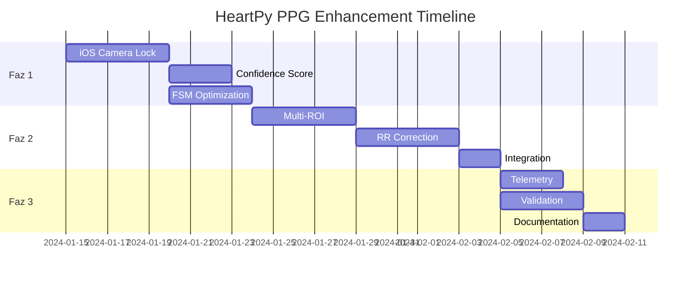

# 📱 HeartPy PPG Signal Processing - Geliştirme Planı

## 🎯 **Executive Summary**
C++ core zaten endüstri standardının üstünde güçlü bir sinyal işleme altyapısına sahip. Ana hedef: iOS kamera kontrollerini optimize ederek SNR/confidence artırmak ve mevcut FSM mimarisini güçlendirmek.

**Hedef Metrikler:**
- SNR: **≥3 dB artış**
- Confidence median: **≥0.7**
- HR accuracy: **MAE ≤2 bpm**
- Warmup süresi: **≤3 saniye**
- Thrash rate: **~0/dakika**

---

## 📋 **Faz 1: Kritik Altyapı (Sprint 1 - 2 hafta)**

### 1.1 iOS Kamera Kilitleme Sistemi 🔒
**Amaç:** SNR artışı, drift/jitter azaltma

#### Tasks:
```markdown
- [ ] AVFoundation FPS kilidi implementasyonu (60fps sabit)
- [ ] Exposure/ISO manuel kilitleme (clipping önleme)
- [ ] White-balance kilitleme (renk tutarlılığı)
- [ ] Focus kilitleme (yakın mesafe, tek seferlik)
- [ ] Torch kademeli kontrol (0.3→0.6→1.0)
- [ ] CMSampleBuffer PTS extraction optimizasyonu
```

#### Implementation:
```swift
// CameraController.swift
class PPGCameraController {
    func lockCameraSettings(device: AVCaptureDevice) {
        device.lockForConfiguration()
        
        // FPS Lock
        let fps = 60.0
        device.activeVideoMinFrameDuration = CMTime(value: 1, timescale: Int32(fps))
        device.activeVideoMaxFrameDuration = CMTime(value: 1, timescale: Int32(fps))
        
        // Exposure/ISO Lock
        let targetISO = min(200, device.activeFormat.maxISO)
        let targetDuration = CMTime(value: 1, timescale: 120)
        device.setExposureModeCustom(duration: targetDuration, iso: targetISO)
        
        // White Balance Lock
        device.setWhiteBalanceModeLocked(with: device.deviceWhiteBalanceGains)
        
        // Focus Lock
        device.focusMode = .locked
        device.isSubjectAreaChangeMonitoringEnabled = false
        
        device.unlockForConfiguration()
    }
}
```

### 1.2 Birleşik Confidence Score 📊
**Amaç:** Tek noktadan güvenilir kalite metrikleri

#### Tasks:
```markdown
- [ ] SNR normalizasyonu (0-12 dB → 0-1)
- [ ] AC/DC ratio normalizasyonu
- [ ] Periodicity score entegrasyonu
- [ ] Weighted combination formula
- [ ] FSM threshold bağlantısı
```

#### Implementation:
```cpp
// confidence_calculator.cpp
class ConfidenceCalculator {
    float computeUnifiedConfidence(const QualityMetrics& metrics) {
        float snrNorm = normalize(metrics.snrDb, 0.0f, 12.0f);
        float acdcNorm = normalize(metrics.acDcRatio, 0.002f, 0.02f);
        float periodNorm = metrics.periodicity;
        
        return clamp(
            0.5f * snrNorm + 
            0.3f * acdcNorm + 
            0.2f * periodNorm,
            0.0f, 1.0f
        );
    }
};
```

### 1.3 FSM Güçlendirme 🔄
**Amaç:** Mevcut FSM'i optimize etme

#### Tasks:
```markdown
- [ ] FSM state type sadeleştirme (warmup/cooldown kaldırma)
- [ ] isAnalyzingRef implementasyonu (staleness fix)
- [ ] AppState listener (background handling)
- [ ] Watchdog timer (stall detection)
- [ ] Telemetry events
```

---

## 📋 **Faz 2: Robustness & Accuracy (Sprint 2 - 2 hafta)**

### 2.1 Multi-ROI Signal Processing 🎯
**Amaç:** Motion robustness, stable PPG

#### Tasks:
```markdown
- [ ] 3x3 ROI grid generation
- [ ] Per-patch quality scoring
- [ ] Trimmed mean/median fusion
- [ ] Saturation detection & weighting
- [ ] Motion-robust M-estimator
```

#### Implementation:
```cpp
// multi_roi_processor.cpp
class MultiROIProcessor {
    struct ROIPatch {
        cv::Rect region;
        float quality;
        float meanValue;
    };
    
    float processFrame(const cv::Mat& frame) {
        std::vector<ROIPatch> patches = generateGrid(frame, 3, 3);
        
        for (auto& patch : patches) {
            patch.meanValue = extractGreenChannel(frame(patch.region));
            patch.quality = computePatchQuality(frame(patch.region));
        }
        
        return robustFusion(patches);
    }
    
    float robustFusion(const std::vector<ROIPatch>& patches) {
        // Trimmed mean with quality weighting
        std::vector<float> weightedValues;
        for (const auto& p : patches) {
            if (p.quality > 0.3) {
                weightedValues.push_back(p.meanValue * p.quality);
            }
        }
        return trimmedMean(weightedValues, 0.1); // 10% trim
    }
};
```

### 2.2 Advanced RR Artifact Correction 🔧
**Amaç:** HRV güvenilirliği artışı

#### Tasks:
```markdown
- [ ] MAD/IQR outlier detection
- [ ] Cubic spline interpolation
- [ ] Block artifact detection
- [ ] Correction ratio reporting
- [ ] Quality flag integration
```

#### Implementation:
```cpp
// rr_artifact_correction.cpp
class RRArtifactCorrector {
    struct CorrectionResult {
        std::vector<float> correctedRR;
        int outlierCount;
        float correctionRatio;
    };
    
    CorrectionResult correctRRIntervals(const std::vector<float>& rrIntervals) {
        // MAD-based outlier detection
        float median = computeMedian(rrIntervals);
        float mad = computeMAD(rrIntervals, median);
        float threshold = median + 3.0f * mad;
        
        CorrectionResult result;
        for (size_t i = 0; i < rrIntervals.size(); i++) {
            if (std::abs(rrIntervals[i] - median) > threshold) {
                // Cubic spline interpolation for single outliers
                result.correctedRR.push_back(interpolateRR(rrIntervals, i));
                result.outlierCount++;
            } else {
                result.correctedRR.push_back(rrIntervals[i]);
            }
        }
        
        result.correctionRatio = float(result.outlierCount) / rrIntervals.size();
        return result;
    }
};
```

---

## 📋 **Faz 3: Telemetry & Validation (1 hafta)**

### 3.1 Telemetry Infrastructure 📈
**Amaç:** Performance monitoring & debugging

#### Tasks:
```markdown
- [ ] Event tracking system
- [ ] Metric aggregation
- [ ] Remote logging
- [ ] Performance dashboards
- [ ] Alert thresholds
```

#### Events to Track:
```javascript
// telemetry_events.js
const TelemetryEvents = {
    FSM_TRANSITION: 'ppg_fsm_transition',
    SESSION_OUTCOME: 'ppg_session_outcome',
    QUALITY_METRICS: 'ppg_quality_metrics',
    ERROR_OCCURRED: 'ppg_error',
    TORCH_DUTY: 'torch_duty_cycle'
};

// Example event
logEvent(TelemetryEvents.QUALITY_METRICS, {
    snr: 8.5,
    confidence: 0.72,
    bpm: 72,
    rrCorrectionRatio: 0.02,
    sessionDuration: 45000,
    warmupTime: 2800
});
```

### 3.2 Validation & Testing 🧪
**Amaç:** Ground truth karşılaştırma

#### Tasks:
```markdown
- [ ] Polar H10 integration for reference
- [ ] MAE/MAPE calculation
- [ ] Bland-Altman plots
- [ ] Cross-device testing
- [ ] Edge case scenarios
```

---

## 📊 **Milestone & Deliverables**

### Week 1-2 (Faz 1)
| Deliverable | Success Criteria | Owner |
|------------|------------------|-------|
| iOS Camera Lock | FPS variance <1%, Exposure stable | iOS Team |
| Unified Confidence | Single [0,1] score exposed | C++ Team |
| FSM Optimization | Zero duplicate analyzer creation | React Team |

### Week 3-4 (Faz 2)
| Deliverable | Success Criteria | Owner |
|------------|------------------|-------|
| Multi-ROI | Motion tolerance +50% | C++ Team |
| RR Correction | RMSSD error <5ms | C++ Team |
| Integration | All components working | Full Team |

### Week 5 (Faz 3)
| Deliverable | Success Criteria | Owner |
|------------|------------------|-------|
| Telemetry | Dashboard live | DevOps |
| Validation | MAE <2 bpm proven | QA Team |
| Documentation | Complete API docs | All |

---

## 🚀 **Deployment Strategy**

### Staged Rollout:
1. **Alpha (Internal)**: Core team testing
2. **Beta (Limited)**: 100 users, A/B testing
3. **Production**: Gradual rollout with feature flags

### Feature Flags:
```javascript
const FeatureFlags = {
    USE_CAMERA_LOCK: true,
    USE_MULTI_ROI: false, // Enable after validation
    USE_ADVANCED_RR: false,
    TELEMETRY_ENABLED: true
};
```

---

## ⚠️ **Risk Mitigation**

| Risk | Impact | Mitigation |
|------|--------|------------|
| Camera API changes | High | Version checks, fallbacks |
| Thermal issues | Medium | Torch duty cycle limits |
| Battery drain | Medium | Adaptive sampling rates |
| Cross-device variance | High | Device-specific configs |

---

## 📝 **Definition of Done**

### Code Quality:
- [ ] Unit test coverage >80%
- [ ] Integration tests passing
- [ ] Code review approved
- [ ] No memory leaks (Instruments verified)

### Performance:
- [ ] SNR improvement ≥3dB
- [ ] Warmup time ≤3s
- [ ] CPU usage <15%
- [ ] Memory footprint <50MB

### Documentation:
- [ ] API documentation complete
- [ ] Integration guide updated
- [ ] Troubleshooting guide ready

---

## 🎯 **Success Metrics (KPIs)**

```yaml
technical_metrics:
  - snr_improvement: ≥3dB
  - confidence_median: ≥0.7
  - hr_mae: ≤2 bpm
  - hrv_rmssd_error: ≤5ms
  - warmup_time: ≤3s

user_metrics:
  - session_completion_rate: >85%
  - retry_rate: <10%
  - user_satisfaction: >4.5/5

system_metrics:
  - crash_rate: <0.1%
  - torch_duty_cycle: <90s/session
  - thrash_rate: ~0/min
```

---

## 📅 **Timeline Overview**



---

## 🔬 **Teknik Detaylar**

### Mevcut C++ API Özellikleri

#### ✅ Hazır Olan Bileşenler:
- **Sinyal İşleme:**
  - AC/DC normalizasyonu
  - Tarvainen detrending (smoothness priors)
  - 0.4-3.5 Hz bandpass filtreleme
  - PTS ile uniform resampling/time-warp
  
- **Peak Detection:**
  - Adaptif threshold
  - Refractory period
  - Derivative validation
  
- **Metrikler:**
  - HR/HRV: RMSSD, SDNN, pNN50
  - Spectral: Welch-based LF/HF
  - Quality: SNR, AC/DC ratio, periodicity

#### 🚧 Geliştirilecek Alanlar:

##### iOS Native (Objective-C++):
```objective-c
// PPGCameraManager.mm
@interface PPGCameraManager : NSObject
- (void)lockCameraSettings;
- (void)setTorchLevel:(float)level;
- (CMTime)extractPTS:(CMSampleBufferRef)buffer;
@end
```

##### C++ Enhancements:
```cpp
// heartpy_stream.cpp additions
class EnhancedProcessor {
public:
    // Multi-ROI processing
    float processMultiROI(const cv::Mat& frame);
    
    // Advanced RR correction
    std::vector<float> correctRRIntervals(
        const std::vector<float>& intervals,
        CorrectionMethod method = CorrectionMethod::CUBIC_SPLINE
    );
    
    // Unified confidence
    float computeConfidence(const QualityMetrics& metrics);
};
```

---

## 📦 **Dosya Yapısı**

```
heartpy/
├── docs/
│   ├── PPG_ENHANCEMENT_PLAN.md (bu dosya)
│   ├── CAMERA_PPG_FEATURE_IMPLEMENTATION.md (mevcut)
│   └── API_REFERENCE.md (oluşturulacak)
│
├── HeartPyApp/
│   ├── ios/
│   │   ├── PPGCameraManager.mm (yeni)
│   │   └── PPGMeanPlugin.m (güncelleme)
│   │
│   └── CameraPPGAnalyzer.tsx (güncelleme)
│
├── react-native-heartpy/
│   ├── ios/
│   │   ├── heartpy_stream.cpp (güncelleme)
│   │   └── heartpy_stream.h (güncelleme)
│   │
│   └── android/
│       └── src/main/cpp/
│           └── native_analyze.cpp (güncelleme)
│
└── cpp/
    ├── heartpy_core.cpp (güncelleme)
    └── multi_roi_processor.cpp (yeni)
```

---

## ✅ **Next Steps**

1. **Immediate Actions:**
   - Create GitHub issues for each task
   - Assign team members
   - Set up feature branches
   - Configure CI/CD pipelines

2. **Communication:**
   - Daily standups during implementation
   - Weekly stakeholder updates
   - Slack channel: #heartpy-enhancement

3. **Testing Protocol:**
   - Device matrix preparation
   - Reference hardware setup (Polar H10)
   - Test scenario documentation

---

**Bu plan ile hedeflenen:** C++ core'un gücünü koruyarak, iOS native optimizasyonları ekleyip, end-to-end sistem performansını maksimize etmek. FSM mimarisi zaten sağlam, sadece ince ayarlar ve yeni telemetry ile sahada "rock-solid" bir PPG sistemi elde edilecek. 🚀
